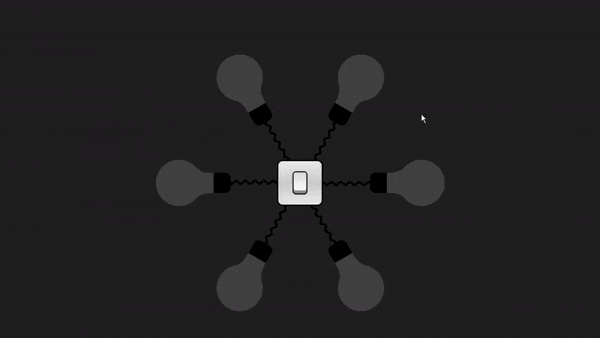

# Light Bulb Animation



A creative and interactive light bulb animation with a switch, built using HTML, CSS, and JavaScript.

## Table of Contents

- [Overview](#overview)
- [Features](#features)
- [Installation](#installation)
- [Usage](#usage)
- [Contributing](#contributing)
- [License](#license)

## Overview

This project showcases a visually appealing light bulb animation with a switch. The animation is achieved through a combination of HTML, CSS, and JavaScript, providing an interactive experience for users.

## Features

- Realistic light bulb animation.
- Interactive switch with a click sound effect.
- Responsive design for various screen sizes.

## Installation

1. Clone the repository to your local machine:

   ```bash
   git clone https://github.com/your-username/light-bulb-animation.git
  ```
 2. Open this directory:
` cd light-bulb-animation `
``````
## Usage 

Open the index.html file in your preferred web browser to view the light bulb animation. Click on the switch to toggle the light bulb on and off, accompanied by a satisfying click sound effect.

## Contributing

If you'd like to contribute to this project, feel free to fork the repository and submit a pull request. Bug reports, suggestions, and feedback are also welcome!

## License


Feel free to customize this Markdown code based on additional details about your project or specific instructions for users.


  
